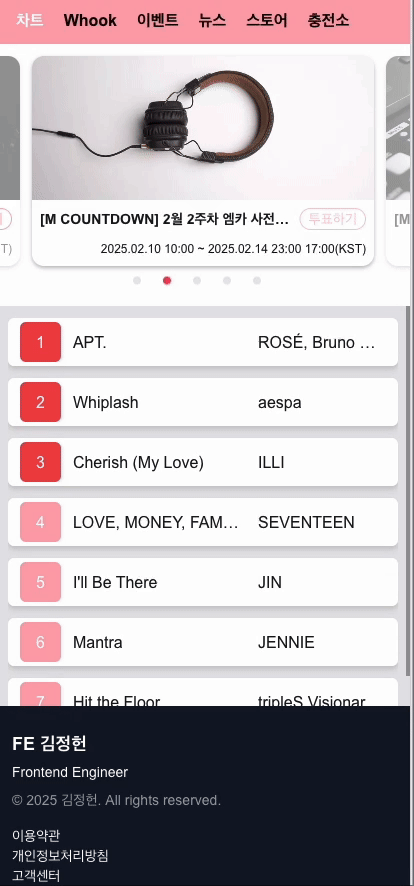
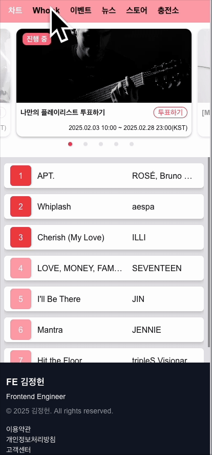
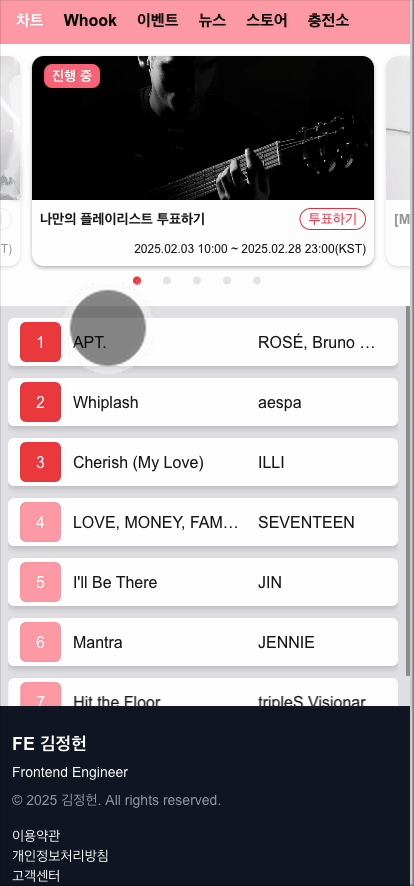
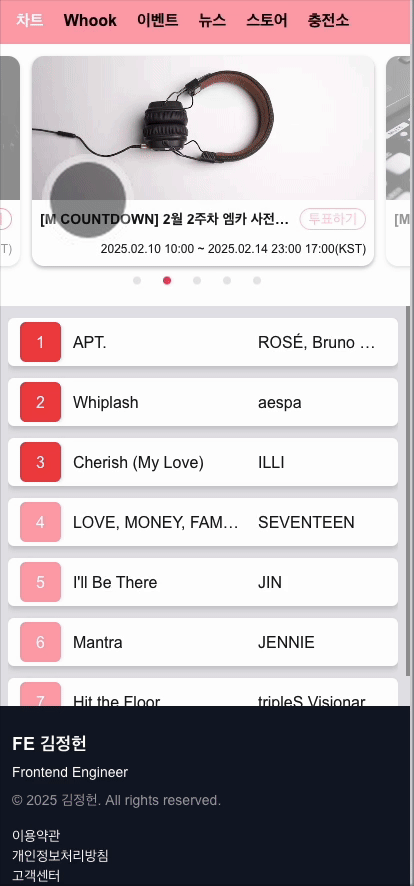
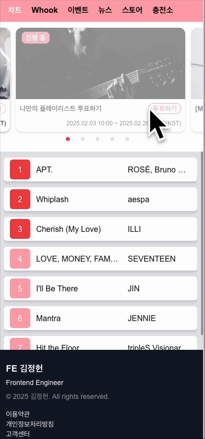
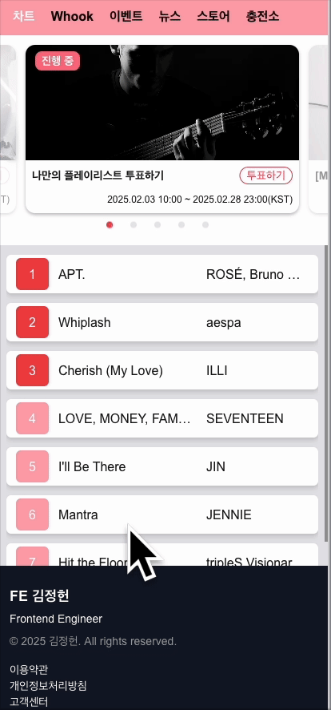

# FE 지원자 김정헌 코딩테스트 과제

## 📌 개요

- 배포 url

```
https://slide-next.vercel.app/chart
```

기본 구현사항 만족

- [x] 카테고리 상단 메뉴 클릭시 이동 가능
- [x] 카테고리 좌 <-> 우 슬라이드로 이동 가능
- [x] 카테고리 이동 시 link 색상 변경
- [x] 배너부분 carousel 구현
- [x] 배너 무한 swipe 가능
- [x] 배너 영역 외부 링크 이동 가능
- [x] 새로형 콘텐츠 순위 구현
- [x] 푸터 영역 구현

추가 구현

- 세로형 콘텐츠 순위 영역 무한스크롤 및 페이지 네이션 진행
- 외부 링크 이동 시, 보안 코드 추가
- 콘텐츠 애니메이션 추가
- 에러 바운더리 추가
- 서비스 미진행 페이지 추가
- 컴포넌트 폴더구조 내 캡슐화 진행
- Co-location 기반 작업
- layout 적극 이용 및 확장성 고려

## 🚀 기술 스택

- **프레임워크/라이브러리**: React, Next.js, TypeScript
- **상태 관리**: zustand
- **데이터 베이스**: Mongo DB, mongoose
- **시간 처리**: Day.js
- **스타일링**: Tailwind CSS

## 🎥 동작

1. 슬라이드로 카테고리 이동

<div align="center">

</div>
<br />

2. 클릭으로 카테고리 이동

<div align="center">

</div>
<br />

3. 베너 스크롤

<div align="center">

</div>
<br />

4. 외부 링크 이동

<div align="center">

</div>
<br />

5. 투표 페이지 이동

<div align="center">

</div>
<br />

6. 콘텐츠 영역 무한 스크롤

<div align="center">

</div>
<br />

## 문제해결

### 1. 터치이벤트 중복 발생

배너를 슬라이드할 때 페이지 이동까지 동시에 발생하였습니다.
같은 이벤트로 인식하였으며 `e.stopPropagation()`을 사용해도 계속 이벤트가 전파되는 문제가 발생했습니다.
<br />
이를 방지하기 위해 전역상태 라이브러리를 사용했으나, 전역 상태를 불러오는 시점의 데이터와 event가 발생하는 시점이 달라 해결 방법을 고민했습니다. zustand의 경우 `getState()`메서드를 이용하여 항상 최신값을 받아 올 수 있다는 것을 공식문서를 통해 알게되었고 배너가 이동할 시, 이 동작을 전역 상태 라이브러리에 업데이트하여 이벤트가 중복 발생하는 것을 방지하였습니다.

### 2. 브라우저 api 요청 시 환경변수 노출 문제

콘텐츠의 경우 처음에는 서버액션을 통해 컴포넌트에서 바로 호출합니다. 그러나 추가 요청을 할 경우에는 클라이언트에서 요청을 진행합니다. 이 경우 환경변수가 노출되는 문제가 있었습니다.
<br />
이를 해결하기 위해 서버 상태에서 실행되는 코드는 유지한테 next.js에서 제공하는 route를 사용해서 next.js 쪽으로 한번 더 요청을 보내도록 구성했습니다.
<br />
실행 되는 코드는 동일하나 코드가 서버에서 실행되도록 유지할 수 있으며, 환경변수를 노출할 필요가 없어, 문제를 해결할 수 있었습니다.

### 3. 크로스 브라우저 스타일 미적용 및 day.js 라이브러리 미동작

사파리에서 몇가지 스타일이 미적용되는 상태가 발생했습니다. 이는 스타일 코드를 통해서 쉽게 수정할 수 있었으나, day.js 라이브러리 미동작 부분은 해결에 많은 어려움이 있었습니다.
<br />
파악한 원인으로는 day.js에서 전달된 값을 변환할때, 크롬에서는 가능하나 사파리에서는 좀 더 엄격한 기준을 적용하기 때문에 잘못된 format으로 인식하여 버그가 발생하였습니다.
검색을 통해 `dayjs.extend(customParseFormat)` 추가로 해결하였지만, 크로스 브라우징 이슈에서는 단순히 스타일 적용 뿐만 아니라 라이브러리 동작 요소까지 테스트를 진행해야 한다는 점을 배웠습니다.

## 배운점

좌우 터치 슬라이드를 구현하기 위해, 다른 플랫폼을 많이 참고하였습니다. 그리고 단순히 많이 알려진 라이브러리를 사용하는 것이 아니라 현재 프로젝트에 적합한 라이브러리를 찾기 위해서 정말 많은 검색과 고민을 하였습니다.
<br />
이번 과제를 통해 정말 서비스를 진행하기 위해서라면, 클린한 코드를 만들기 위해 노력하는 것은 기본이며, 오히려 자료 조사에 더 많은 시간을 투입하고 많은 고민과 비교를 결정해야 한다는 것을 배웠습니다.

좋은기회 주셔서 감사합니다.
